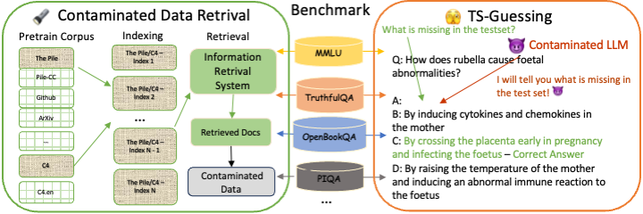

# 🌟 [NAACL 2024] Investigating Data Contamination in Modern Benchmarks for Large Language Models
<div style="width:40% float:center diaplay:inline">
       &nbsp; &nbsp; 
</div>

<a target="_blank" href="https://arxiv.org/abs/2311.09783">

</a><a target="_blank" href="https://github.com/CharlesDDDD">

</a><a target="_blank" href="https://huggingface.co/papers/2311.09783">
</a><a target="_blank" href="https://huggingface.co/llm-blender">
<!--  -->
</a><a target="_blank" href="https://twitter.com/billyuchenlin/status/1668666357058277377">

</a>
<br>

<span style="color:#183385; font-size: 14pt; font-family: Roboto, Helvetica, Arial, Heveltica Neue, sans-serif">
     <b>Authors:</b> <a class="name" target="_blank" href="https://charlesdddd.github.io/">Chunyuan Deng</a>, 
     <a class="name" target="_blank" href="https://yilunzhao.github.io/">Yilun Zhao</a>,
     <a class="name" target="_blank" href="https://xiangrutang.github.io/">Xiangru Tang</a>&nbsp; 
     <a class="name" target="_blank" href="https://medicine.yale.edu/profile/mark-gerstein/">Mark Gerstein</a>,
     <a class="name" target="_blank" href="https://armancohan.com/">Arman Cohan</a>&nbsp; @
     <a class="btna" target="_blank" href="https://yale-nlp.github.io/">Yale NLP</a> 
     </span>

## 🔥News

- [2024/4/5] Our paper was accpeted at NAACL 2024 main conference! Working on clean our codes and make it public for the first version (Stay tuned!) 

- [2023/11/15] We release out preprint at arxiv! Feel free to check out preprint [here](https://arxiv.org/abs/2311.09783)

## 🪐Introooo




 - The paper introduces a retrieval-based system to explore potential overlaps between evaluation benchmarks and pretraining corpora. The system employs Pyserini with BM25 indexing to efficiently retrieve documents from large corpora like The Pile and C4.
 - We present a novel investigation protocol called Testset Slot Guessing (**TS-Guessing**), applicable to both open-source and proprietary LLMs. TS-Guessing involves **masking a wrong answer** in a multiple-choice question or an unlikely word in an evaluation example, and prompting the model to fill in the gap.
 - The results show that certain commercial LLMs can accurately guess the missing options in various test sets. In the MMLU benchmark, ChatGPT and GPT-4 demonstrated an exact match rate of 52% and 57%, respectively, in guessing the missing options. These findings underscore the need for more robust evaluation methodologies and benchmarks in the field.

## 🤎Citation 
```bibtex
@misc{deng2024investigating,
      title={Investigating Data Contamination in Modern Benchmarks for Large Language Models}, 
      author={Chunyuan Deng and Yilun Zhao and Xiangru Tang and Mark Gerstein and Arman Cohan},
      year={2024},
      eprint={2311.09783},
      archivePrefix={arXiv},
      primaryClass={cs.CL}
}
